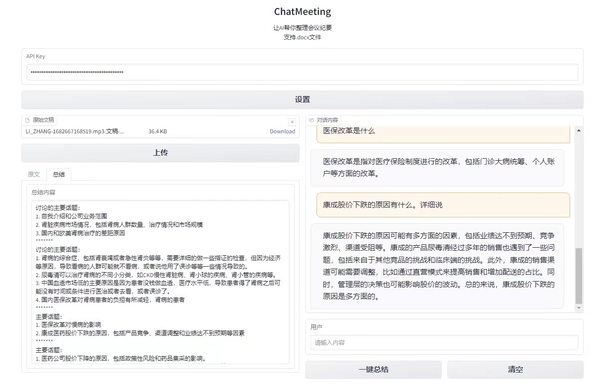

# ChatMeeting

Let AI help you with meeting notes summarization!

ChatMeeting is buit with LangChain & OpenAI API. It can automatically summarize the main points in your draft notes.

It also support Q&A according to your LONG/COMPLICATED notes using vector database.

It is delpoyed on HuggingFace Spaces by Gradio. Click the link below to give it a try!

**[Further Improvement]:**
- Support both Chinese and English
- In order to imporve the efficiency of the model, I fine-tuned a ChatGLM2 model using the dataset VCSum: A Versatile Chinese Meeting Summarization Dataset.
It will be deployed to spaces pretty soon :)

---------------------------------------------------------------------------------
让AI帮你梳理会议记录！

基于Langchain，支持自动整理会议记录大纲+本地向量数据库+QA

使用Gradio部署~

HuggingFace Spaces 体验：[点我试试](https://huggingface.co/spaces/Iris/ChatMeeting)

